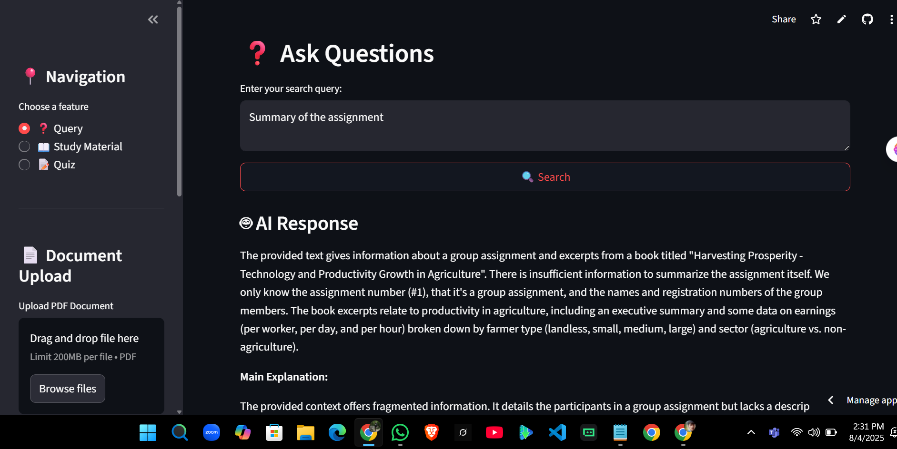

# 📚 EduGuide: AI-Powered Study Assistant

An intelligent, RAG-based study companion that helps students learn from PDF documents through interactive Q&A, quiz generation, and AI-powered study material.

🔗 **Try it live**: [rag-powered-studybuddy.streamlit.app](https://rag-powered-studybuddy.streamlit.app/)



---

## 🚀 Features

- 📄 **PDF Upload & Processing** – Upload any study material in PDF format
- 🤖 **AI-Powered Q&A** – Ask natural questions and get accurate answers
- 🧠 **Study Material Generator** – Summarized, well-structured notes from documents
- 📝 **Quiz Generator** – Generate interactive quizzes with answers and explanations
- 📊 **Progress Tracking** – Track your learning history and activities

---

## 🧠 Powered By

- **Frontend**: Streamlit  
- **Backend**: FastAPI  
- **AI & RAG**: LangChain + Google Gemini  
- **Embeddings**: `sentence-transformers/all-MiniLM-L6-v2`  
- **Vector Store**: FAISS  
- **PDF Parsing**: PyPDF2

---

## 🗂️ Project Structure


```
EduGuide/
├── backend/           # FastAPI backend
├── frontend/         # Streamlit frontend
├── data/            # Data storage (gitignored)
└── requirements.txt  # Project dependencies
```

## Setup

1. Clone the repository:
```bash
git clone https://github.com/asiifkarim/RAG-Powered-StudyBuddy.git
cd RAG-Powered-StudyBuddy
```

2. Create and activate virtual environment:
```bash
python -m venv venv
.\venv\Scripts\activate
```

3. Install dependencies:
```bash
pip install -r requirements.txt
```

4. Create `.env` file and add:
```
GOOGLE_API_KEY=your_api_key_here
```

5. Start the backend server:
```bash
cd backend
uvicorn main:app --reload
```

6. Start the frontend (in a new terminal):
```bash
cd frontend
streamlit run app.py
```

## Usage

1. Upload a PDF document using the sidebar
2. Ask questions about the content
3. Generate study materials
4. Create and take quizzes
5. Track your progress

## Technologies Used

- Frontend: Streamlit
- Backend: FastAPI
- AI: LangChain, Google Gemini
- Vector Store: FAISS
- Document Processing: PyPDF2
>>>>>>> f855ef0 (Initial commit with backend and frontend)

